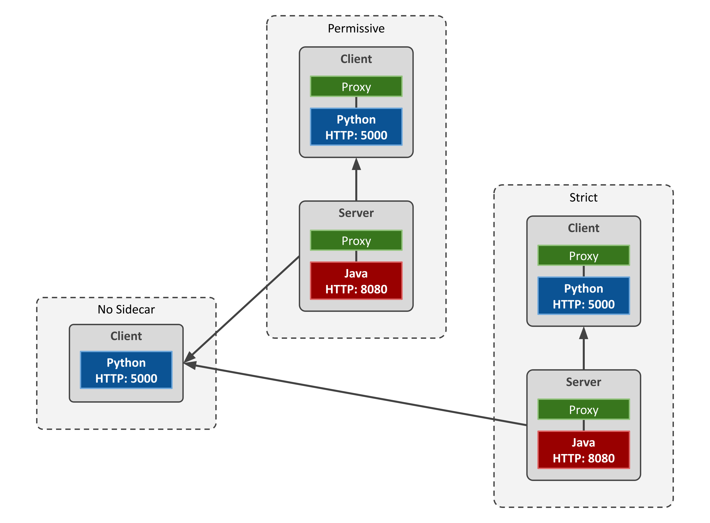

# Learning Istio

## Before Start

You need configure the environment.
Here, I show how to do it on Ubuntu.

### Install Docker

```sh
sudo apt-get update
sudo apt-get install ca-certificates curl gnupg lsb-release
sudo mkdir -p /etc/apt/keyrings
curl -fsSL https://download.docker.com/linux/ubuntu/gpg | sudo gpg --dearmor -o /etc/apt/keyrings/docker.gpg
echo "deb [arch=$(dpkg --print-architecture) signed-by=/etc/apt/keyrings/docker.gpg] https://download.docker.com/linux/ubuntu $(lsb_release -cs) stable" | sudo tee /etc/apt/sources.list.d/docker.list > /dev/null
sudo apt-get update
sudo apt-get install docker-ce docker-ce-cli containerd.io docker-compose-plugin
sudo usermod -aG docker $USER && newgrp docker
sudo docker run hello-world
```

### Install Minikube

```sh
curl -LO https://storage.googleapis.com/minikube/releases/latest/minikube-linux-amd64
sudo install minikube-linux-amd64 /usr/local/bin/minikube
minikube config set driver docker
minikube delete
minikube start
alias kubectl="minikube kubectl --"
eval $(minikube docker-env)
kubectl get pods
```

### Install Istio

```sh
curl -L https://istio.io/downloadIstio | sh -
cd istio-1.14.1
export PATH=$PWD/bin:$PATH
istioctl x precheck
istioctl install --set profile=minimal
istioctl analyze
```

### Check Authentication Policies

```sh
kubectl get peerauthentication --all-namespaces
kubectl get destinationrule --all-namespaces
```

### Build, Try and Dockerize Applications

#### Python Client

```sh
cd ~/apps/python-client
sudo apt install python3-pip
pip install -r requirements.txt
python3 main.py
curl http://localhost:5000
docker build -f Dockerfile -t python-client:latest .
```

#### Java Server

```sh
cd ~/apps/java-server
sudo apt-get install openjdk-17-jdk
./mvnw spring-boot:build-image
java -jar target/java-server-latest.jar
curl http://localhost:8080
docker build -f Dockerfile -t java-server:latest .
```

## Hands On

Workloads:
- Java Servers, with sidecar;
- Python Clients, with and without sidecar;

Namespaces:
- Permissive: workloads accept both mutual TLS and plain text traffic.
- Strict: workloads only accept mutual TLS traffic.
- No Sidecar: client app without proxy, i.e no mTLS.

## Initial Scenario



All namespaces configured as default authentication mode (Permissive)

```sh
kubectl create ns permissive
kubectl apply -f <(istioctl kube-inject -f java-server/deployment.yaml) -n permissive
kubectl apply -f <(istioctl kube-inject -f python-client/deployment.yaml) -n permissive

kubectl create ns strict
kubectl apply -f <(istioctl kube-inject -f java-server/deployment.yaml) -n strict
kubectl apply -f <(istioctl kube-inject -f python-client/deployment.yaml) -n strict

kubectl create ns nosidecar
kubectl apply -f python-client/deployment.yaml -n nosidecar

for from in "permissive" "strict" "nosidecar"; do for to in "permissive" "strict"; do kubectl exec "$(kubectl get pod -l app=python-client -n ${from} -o jsonpath={.items..metadata.name})" -c python-client -n ${from} -- curl http://java-server.${to}:8080 -s -o /dev/null -w "python-client.${from} to java-server.${to}: %{http_code}\n"; done; done
```

## References

- https://istio.io/latest/docs/tasks/security/authentication/mtls-migration/
- 
